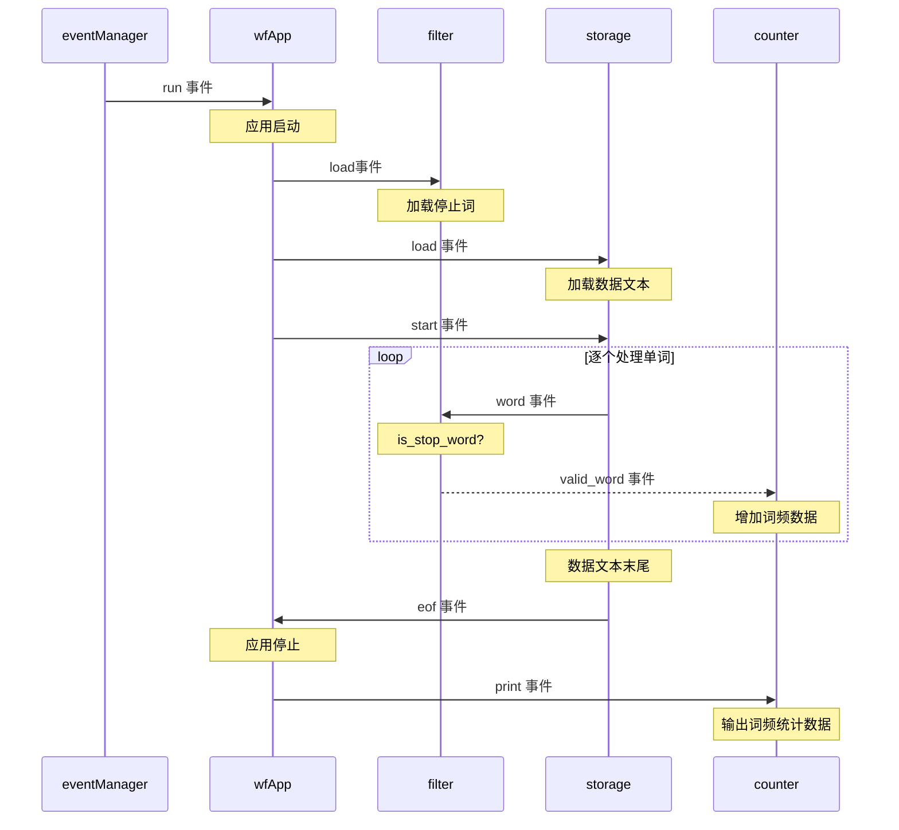

# 公告板风格

## 约束

- 利用不同形式抽象（对象、模块等），分解较大问题为若干实体
- 实体不能被直接调用
- 有一个用于**发布和订阅事件**的基础结构，执行所有事件的管理和分配工作 —— 公告板
- 实体在公告板发布事件订阅 —— “需要”某信息；并在公告板发布事件 —— “提供”某信息

## 注解

公告板风格中，实体不能相互调用其中的过程。通过移除所有应用相关的语义加上仅适用发布、订阅两个通用操作，联结所有实体的公告板相较好莱坞风格更加通用。

示例程序定义了实现公告板概念的通用`EventManager`类，并封装了以事件类型为键名的订阅字典`self._subscriptions`，通过`subscribe`和`publish`方法操作。

``` python

class EventManager:
    _subscriptions = {}

    def subscribe(self, event_type, handler):
        if event_type in self._subscriptions:
            self._subscriptions[event_type].append(handler)
        else:
            self._subscriptions[event_type] = [handler]

    def publish(self, *event):
        event_type = event[0]
        if event_type in self._subscriptions:
            for h in self._subscriptions[event_type]:
                h(*event[1:])
```

实体的划分与其他对象风格一致：数据存储`DataStorage`、停止词过滤器`StopWordFilter`和词频统计器`WordFrequencyCounter`。此外，还增加`WordFrequencyApplication`类用于*开始并结束词频应用程序*。**类的交互订阅事件通知和发布自身事件实现**。事件流水线如下：



公告板风格常和异步组件共同使用，但并非必须，如示例程序中实体同步处理完订阅事件才返回。处理事件的基础结构可能更加复杂，如几个组件相互作用实现**事件分发**；事件结构也可能更加复杂，以支持更精确的事件过滤，如组件**订阅不同事件类型及其内容的组合**。

公告板风格采用的控制反转是最极端、最轻量的形式。**订阅是匿名的**，即生成事件的组件原则上不知道什么组件会处理事件，因而支持非常灵活的实体组合机制。但同好莱坞风格一样，**系统的错误行为可能很难被追踪**。

## 发展历程

公告板风格的历史可以追溯至USENET —— 一种起源于20世纪70年代的分布式新闻系统。不同现代许多发布-订阅系统，USENET没有管理新闻的中央服务器，它仅包含一些松耦合的新闻服务器，可能位于不同机构，并在服务器之间分发用户发布的信息。互联网的出现让USENET越来越不受欢迎，但其概念在**RSS协议**中重新兴起。

公告板风格最适用于发布-订阅式结构的系统。由于其良好的可扩展性以及对未知系统演变的支持（如增加、移除组件，分发新的事件类型等），大规模计算资源的场景中非常受欢迎
